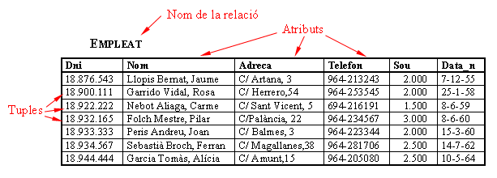

# 2. Estructura del Model Relacional

L'element basic del Model Relacional es la **RELACI Ó**, que sera una taula o
matriu bidimensional amb unes caracteristiques o restriccions que comentarem
mes avant.

Normalment una relacio te un **NOM** (p.e. **Empleat**) encara que
ocasionalment no en tindra, per exemple una taula que siga el resultat d'una
consulta poc frequent.

Les **FILES** , on tenim la informacio de les ocurrencies, dels individus,
tambe s'anomenen **TUPLES** (de vegades per similitud amb fitxers tambe
s'anomenen **REGISTRES**).

Les **COLUMNES** , que seran caracteristiques que ens interessen dels
individus i que en cada tupla agafa un valor, les anomenarem tambe
**ATRIBUTS** (o **CAMPS**).

El conjunt de valors possibles que pot agafar un atribut determinat s'anomena
**DOMINI**. Mes avant veurem que els dominis s'intentaran definir el millor
possible, per prevenir errors.

L'**ESQUEMA o ESTRUCTURA DE LA RELACI Ó** es la definicio de la relacio, es a
dir, atributs que te, dominis d'aquestos i restriccions que podrem definir,
que veurem en la seguent pregunta.

L'**ESTAT DE LA RELACI Ó** es la informacio que conte en un determinat moment.
Normalment l'estat variara continuament al llarg del temps, be perque
s'afegeixen noves tuples (augmenta la cardinalitat), be perque es modifica el
valor d'algun atribut en alguna tupla. En canvi l'esquema dificilment
canviara.

Una **CLAU CANDIDATA** es un atribut o conjunt d'atributs que identifiquen
univocament cada tupla de la relacio. En l'exemple podrien ser claus
candidates **Dni** , **Nom** , fins i tot ens podriem plantejar combinacions,
com el conjunt **(Nom, Data_n)** , ja que sembla impossible que dues persones
de l'empresa es diguen igual i damunt hagen nascut el mateix dia. De entre
totes les claus candidates en triarem una, que sera la **CLAU PRINCIPAL** o
**CLAU PRIM ÀRIA**, i servira per a identificar de forma efectiva en el Model
cadascuna de les tuples.

Podria donar-se el cas que un atribut no agafe cap valor per a una tupla
determinada, per exemple, un empleat que no tinga telefon. Aleshores li
donarem el **VALOR NUL**.

Per ultim, les relacions o taules poden ser **PERMANENTS** o **TEMPORALS**.
Les primeres es guarden. Les segones, normalment resultat d'una consulta
ocasional, no.

Representarem la taula amb el nom de la taula en majuscules seguit, entre
parentesis, en minuscules i separats per comes, pels noms dels camps, amb la
clau principal subratllada. Tambe es convenient fugir dels caracters especials
(vocals accentuades, ç, ñ, guionet, ...) per no tenir problemes quan anem a
implementar-la en un SGBD determinat (Access, Oracle, PostgreSQL, ...). Per a
una millor lectura intentarem posar sempre la clau principal al principi, el o
els primers camps.

EMPLEAT (dni, nom, adreca, telefon, sou, data_n)

Tambe podem utilitzar una forma alternativa de representar-la, amb un requadre
que agafa tota la taula, dalt el nom de la taula, i baix cadascun dels camps,
posant la clau principal en negreta o subratllada.

Llicenciat sota la  [Llicència Creative Commons Reconeixement NoComercial
CompartirIgual 3.0](http://creativecommons.org/licenses/by-nc-sa/3.0/)

