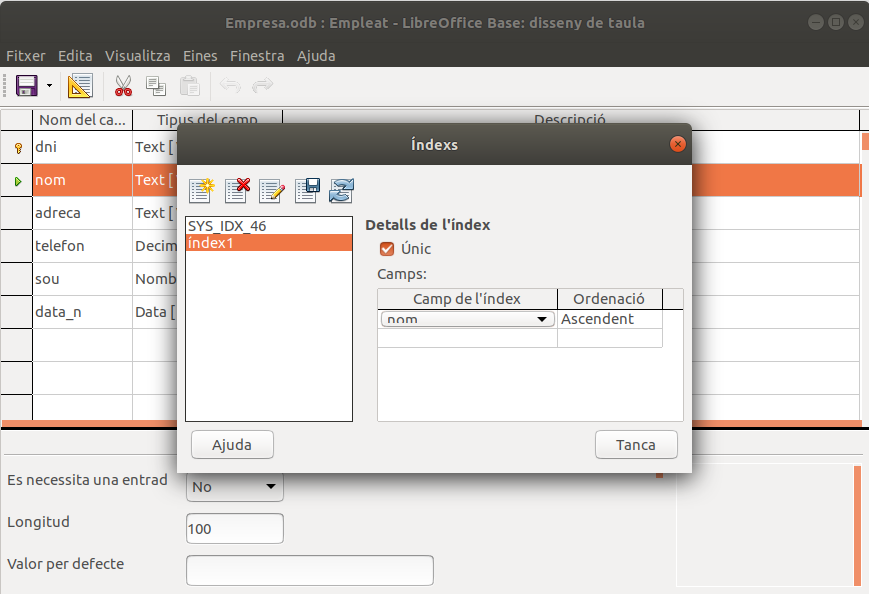

Bases de Dades

# **3.2.3 Restricció d'unicitat**

Si en un camp, o en un conjunt de camps, definim la restricció d'unicitat (**UNIQUE**), això obliga a que, en cas de tenir valors el camp, no es puguen repetir. Suposem, per exemple, els alumnes d'un Institut. La clau no pot ser el DNI, ja que alguns alumnes no en tindran, però en cas de tenir-ne, és clar que no es podrà repetir.

Representarem que un camp és únic, posant **únic** entre parèntesi baix del camp. Per exemple, si considerem que el camp nom de la taula EMPLEAT ha de ser únic, ho representarem així:

EMPLEAT (dni, nom, adreca, telefon, sou, data\_n) 

(únic)

En **Access** la restricció d'unicitat (**UNIQUE**)** es defineix posant en l'apartat ***Indexado*** el valor ***Sí (sin duplicados)***. En la figura es mostra com fer que el camp **nom** de la taula **EMPLEAT** siga únic.

En **Base** de **LibreOffice** es fa creant un índex, en el símbol   ![ref2]

Haurem crear un nou índex, el camp pel qual volem l'índex, l'ordre que ens interessa (normalment ascendent) i **deixar activa la casella Únic**

En aquesta imatge es veu com pel fet d'haver creat la clau principal, ja s'havia creat un índex, en la imatge **SYS\_IDX\_46**. No es tracta de modificar aquest, sinó crear-ne un nou.

Llicenciat sota la [Llicència Creative Commons Reconeixement NoComercial CompartirIgual 3.0](http://creativecommons.org/licenses/by-nc-sa/3.0/)

