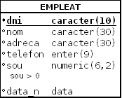
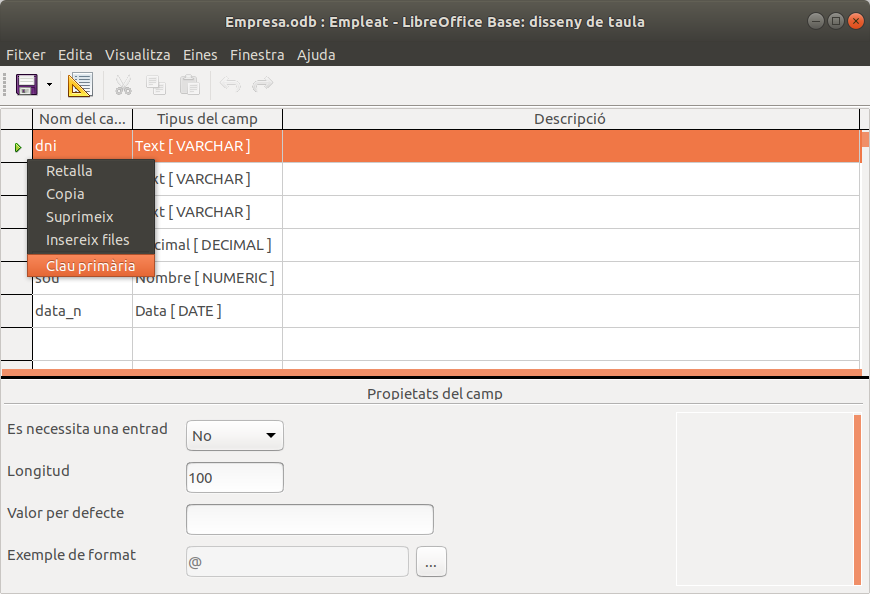
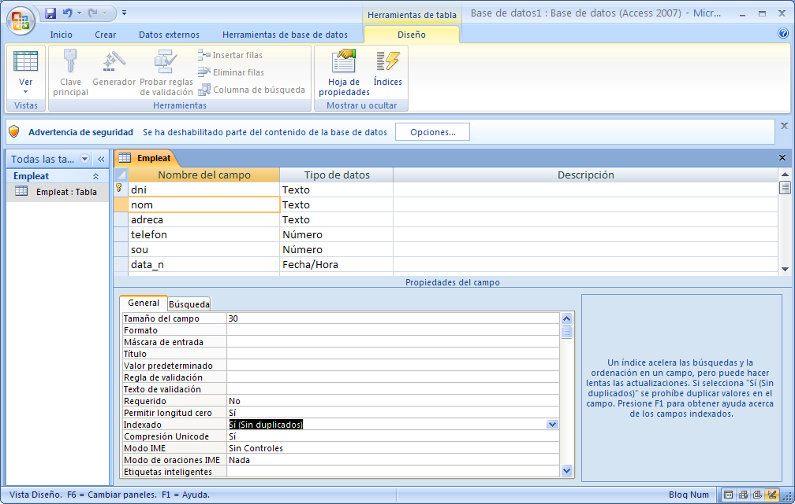
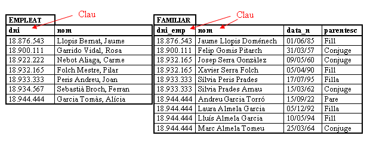
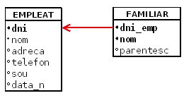

# 3. Restriccions

Igual que en altres models de dades, en el Model Relacional existeixen
restriccions, és a dir, estructures o ocurrències no permeses.

Aquestes restriccions poden ser de dos tipus fonamentals: **restriccions
inherents** , que són imposades pel propi model, i **restriccions d'usuari**
(també anomenades restriccions **semàntiques**) en les quals és l'usuari qui
prohibeix, perquè el model li ho permet, determinades circumstàncies per a
poder definir millor la Base de Dades.

## 3.1 Restriccions inherents

Com hem dit són les que imposa el propi model. Algunes són característiques
que han d'acomplir les relacions. Per tant no qualsevol taula matemàtica és
una relació. Podem considerar les següents:

  * **Valors atòmics** : cada valor de la taula, és a dir, qualsevol valor de qualsevol atribut de qualsevol tupla ha de ser simple, no divisible. Per tant no valen atributs compostos o repetitius.

> Així, si considerem **Nom** en la relació **Empleat** com a nom de pila més
> cognoms, no serà divisible (no podré agafar posteriorment el nom de pila per
> una banda i els cognoms per una altra; si ho volguera fer, s'haurien de
> definir els atributs simples **Cognom1** , **Cognom2** i **Nom**).

> Tampoc valen valors repetitius, per exemple un vector de 12 entrades. Queden
> per tant descartats els atributs **_multivaluats_**.

  * **Tuples distintes** : no poden haver dues tuples iguals. Això és una diferència respecte a les taules matemàtiques on sí que es poden duplicar files. 

  

  * **L'ordre de les tuples no és significatiu**. 

  

  * **L'ordre dels atributs no és significatiu**. 

## 3.2 Restriccions d'usuari

Les anteriors són condicions, imposicions que ens dóna el mateix model.

Les realment interessants per a nosaltres són les restriccions d'usuari, també
anomenades restriccions semàntiques, ja que seran condicions que podrem posar
nosaltres per a que l'esquema de la B.D. explique el millor possible la
realitat, i evitar possibles errors en les dades.

### 3.2.1 Restricció de domini

El valor d'un atribut ha de ser un valor atòmic del domini. Definint clarament
el domini ens assegurem (dins del possible) que l'atribut no puga agafar
valors incorrectes.

Per una banda, el domini serà d'un tipus determinat, triat d'una gamma prou
extensa: enter curt, enter, enter llarg, real, doble precisió, caràcter,
cadena de caràcters (text), data, hora, ...

Així, per exemple, definint el _Sou_ com un número real impedirem que per
error puga agafar el valor 2.**R** 00'00, o que la _data de naixement_ , amb
domini de tipus data, siga 15-**14** -1958 o **31** -**2** -1958.

També es podran definir dominis que estiguen en un determinat interval (nota
d'un examen: 0-10) o d'un tipus enumerat (nota d'avaluació: MD, IN, SUF, BE,
NOT, EXC).

Es poden definir regles de verificació o validació (**CHECK**) que ens ajuden
a perfilar molt bé el domini. Aquest seria un exemple d'exigir que el
treballador tinga de 18 a 65 anys. La sintaxi és inventada, només per a
entendre-ho, amb una hipotètica funció que trau l'any, i una altra que ens
dóna la data d'avui.

~~~
CHECK ( Any(avui - data_n) >= 18) and (Any(avui - data_n) < 65) )
~~~

> **_Nota_**

> En **Access** la regla de validació seria:

~~~
AgregFecha("aaaa";18;[data_n])<=Ahora() Y AgregFecha("aaaa";65;[data_n])>=Ahora()
~~~

> on es veu que la fórmula és afegir 18 anys a la data de naixement i
> comprovar que no supera la data d'avui; i afegir 65 anys a la data de
> naixement i comprovar que sí supera la data d'avui.

Per exemple, **Empleat** podria quedar:
~~~
EMPLEAT (_dni_ :caràcter(10), nom:caràcter(30), adreca:caràcter(30), telefon:enter(9), sou:numèric(6, ), data_n:data)
~~~
amb la regla de validació:
~~~
CHECK Sou > 0
~~~
a banda de la mencionada anteriorment.

Si utilitzem la manera de representar alternativa, ho tindríem així:

La següent imatge mostra com es faria en **Access** la primera regla de
validació, aplicada al camp **data_n**

**_Nota_**

En Base de LibreOffice resulta més complicada la creació de regles de
validació. S'ha de fer per mig de Macros associades a formularis

### 3.2.2 Restricció de clau principal

Permet declarar un atribut o un conjunt d'atributs com a **CLAU PRINCIPAL** o
**PRIMÀRIA** (Primary Key). Aquesta clau principal servirà per a identificar
unívocament cadascuna de les files.

Com a conseqüència de l'anterior, la clau principal no podrà agafar valors
nuls ni repetits, ja que en cas contrari no es podria assegurar la
identificació de les files.

Aquestes últimes característiques també les podran tenir altres atributs, cosa
que dóna lloc als tipus de restricció que es veuen en els següents punts.

Nosaltres sempre definirem una clau principal. Si tenim claus candidates,
triem una d'elles com a clau principal. Si no en tenim, ens inventem un camp
que servirà de clau principal (bé un número o bé un codi alfanumèric).

No és convenient que la clau principal estiga formada per un número excessiu
de camps. Podríem dir que 3 és el màxim. Si la clau candidata està formada per
més de 3 camps, o bé triem una altra clau candidata, o bé ens inventem una.

En **Access** es marca la clau principal amb una figura d'una clau. En la
figura es veu com fer que el camp **dni** siga la clau principal de la taula
**EMPLEAT** :

En **LibreOffice Base** es fa de la mateixa manera:

### 3.2.3 Restricció d'unicitat

Si en un camp, o en un conjunt de camps, definim la restricció d'unicitat
(**UNIQUE**), això obliga a que, en cas de tenir valors el camp, no es puguen
repetir. Suposem, per exemple, els alumnes d'un Institut. La clau no pot ser
el DNI, ja que alguns alumnes no en tindran, però en cas de tenir-ne, és clar
que no es podrà repetir.

Representarem que un camp és únic, posant **únic** entre parèntesi baix del
camp. Per exemple, si considerem que el camp nom de la taula EMPLEAT ha de ser
únic, ho representarem així:
~~~
EMPLEAT (_dni_ , nom, adreca, telefon, sou, data_n)  
                (únic)
~~~

En **Access** la restricció d'unicitat (**UNIQUE**)**** es defineix posant en
l'apartat**_Indexado_** el valor _**Sí (sin duplicados)**_. En la figura es
mostra com fer que el camp **nom** de la taula **EMPLEAT** siga únic.

En **Base** de **LibreOffice** es fa creant un índex, en el símbol

Haurem crear un nou índex, el camp pel qual volem l'índex, l'ordre que ens
interessa (normalment ascendent) i **deixar activa la casella Únic**

En aquesta imatge es veu com pel fet d'haver creat la clau principal, ja
s'havia creat un índex, en la imatge **SYS_IDX_46**. No es tracta de modificar
aquest, sinó crear-ne un nou.

### 3.2.4 Restricció de valor no nul

Obliga a que el camp agafe sempre un valor. Per exemple, el camp **Nom** és un
bon candidat a ser no nul.

Ho representarem posant **no nul** entre parèntesi baix del camp.
~~~
EMPLEAT (_dni_ , nom, adreca, telefon, sou, data_n)  
                (no nul)
~~~
P er mig de la representació alternativa, podem marcar amb un punt negre
davant del camp no nul.

En Access la manera de posar un camp com a **NOT NULL** serà posar en
l'apartat _**Requerido**_ el valor _**Sí**_

_****_

En **Base** de **LibreOffice** haurem de posar **Sí** a l'apartat **Es
necessita una entrada******

### 3.2.5 Integritat referencial

Per poder explicar-la ens recolzarem en un exemple.

que es podria traduir en les següents taules:

Si en una taula R2 (**Familiar**) tenim un atribut (**dni_emp**) que és clau
(primària o candidata) d'una altra taula R1 (**Empleat****\-- > dni**), tot
valor d'aquell atribut ha de concordar amb un valor de la clau de R1 (no he de
poder posar en familiar un Dni que no el tinga cap empleat de l'empresa).
L'atribut en R2 és, per tant, una **CLAU EXTERNA**.

Ha de ser impossible posar en **Familiar** el Dni 18.754.321, perquè no està
en l'altra, i per tant no és un Dni d'un empleat de l'empresa.

Les relacions R1 i R2 no tenen per què ser distintes, poden ser la mateixa.
Així, si considerem el supervisor, aquest ha de ser de l'empresa:

Supervisor és una clau externa, però de la mateixa taula. No tots els SGBD
permeten una clau externa reflexiva.

Una manera de representar les claus externes en l'esquema és la següent:

  
On el doble subratllat indica una clau externa (que en aquest exemple, a més,
forma part de la clau principal, però que no sempre serà així) que “apunta” a
la clau principal de l’altra taula.

L'altra manera, utilitzant la forma alternativa, serà aquesta, que també és
molt fàcil d'entendre:

Açò ens impedirà que introduïm valors no correctes, no existents. ¿Però què
passarà si esborrem un empleat, o si modifiquem el seu Dni? ¿Què fem amb els
familiars? Doncs en principi tres podrien ser les accions a realitzar, i
depenent de la situació particular triaríem una o una altra:

  * No deixar esborrar-lo o modificar-lo (**NO ACTION**).  
Segurament no és l'opció més adequada per a l'exemple dels empleats i els
familiars. Però pensem en un altre exemple, amb clients i factures. Què fem si
s'esborra un client i tenim factures d'ell? Segurament el més adequat serà no
fer l'acció, és a dir, no esborrar el client (sobretot si les factures estan
pendentes de cobrar ...).

  * Esborrar també els familiars o canviar-los **en cascada**(**CASCADE**).  
Segurament aquesta és l'opció més adequada per al cas dels familiars, que
s'eliminen automàticament.

  * Canviar el valor de la clau externa al valor nul o un valor predeterminat (**SET NULL** o **SET DEFAULT**).  
En l'exemple dels familiars no té sentit ja que no ens interessen els
familiars dels que no són de l'empresa. Però imaginem, per exemple, un
proveïdor que ens ha proporcionat uns articles. Pel fet de no treballar ja amb
el proveïdor i llevar-lo de la B.D. no hauríem d'eliminar els articles. Seria
suficient amb donar un valor nul al proveïdor d'aquest
article[1].

Hi ha SGBD que fins i tot permeten accions distintes per al cas d'esborrament
i d'actualització de la clau, com per exemple Access.

En **Access** les restriccions d'integritat (claus externes) es defineixen amb
les **relacions** entre taules. El següent vídeo mostra com crear la clau
externa de Familiar cap a Empleat, i es pot observar com la manera de
representar-lo és molt pareguda a la forma alternativa que estem utilitzant.

Hem d'assegurar-nos sobretot que la tala principal està a l'esquerra en a
imatge 5, i que l'altra està a la dreta marcada com "taula relacionada".

I aquest seria la manera de fer-ho en **Base de LibreOffice** , totalment
paral·lela, però millor arrastrar al revès, de la relacionada a la principal

* * *

[1]Observem, però, que aquesta clau externa hauria d'admetre valors nuls. Si no ho permet,
millor un valor per defecte.

### 3.2.6 Restriccions externes

A pesar de totes les restriccions anteriors, que normalment els SGBDR
compleixen, hi ha d'altres que no es poden expressar per mig del Model
Relacional, i per tant no poden complir directament els SGBDR. Són les
**restriccions externes a l'esquema relacional**. Estaran normalment les
heretades dels Model E/R, i hi hauran algunes més que sí que es podien
expressar en el Model E/R, però no en el Model Relacional. Les veurem en la
pregunta 4.

Els SGBDR més avançats, més potents, permetran un tractament a aquestes
restriccions externes, consistents en executar un procediment definit per
l'usuari després d'una actualització. Són els **Disparadors**(**TRIGGERS**).
Aquest concepte és molt potent, ja que dóna una resposta procedimental on es
pot fer qualsevol cosa.

En **Access** dues seran les ferramentes per a fer açò, les **Macros** i
procediments en Visual Basic.

En **Base** de **Libreoffice** només tenim les **Macros** , però no seran com
les d'Access amb accions predeterminades, sinó directament procediments en
LibreOffice Basic

Llicenciat sota la  [Llicència Creative Commons Reconeixement NoComercial
CompartirIgual 3.0](http://creativecommons.org/licenses/by-nc-sa/3.0/)

