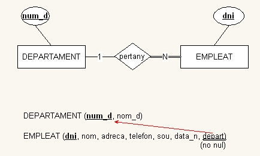

# 4.2 Relacions 1:N

Per cada relació 1:N entre les entitats **A** i **B** , on **A** és la que
participa amb grau de cardinalitat 1, i **B** amb grau N, s'inclou un nou camp
en **B**(del mateix tipus que la clau principal de**A**) que a més serà **clau
externa** que apuntarà a **A** , més concretament a la clau principal de
**A**. En moltes ocasions al camp nou de **B** se li posa el mateix nom que a
la clau principal de **A** , però no és necessari, depén del gust de cadascú.

També s'inclouran en **B** tots els possibles atributs de la relació.

La següent animació intenta explicar-ho millor:

Si a més l'entitat que participa amb grau N ho fa de forma **total**(com en la
figura de baix), la clau externa **no pot ser nula** (és a dir sempre ha de
tenir un valor).

En l'exemple nostre:

  * Per la relació **_Pertany_** (figura de dalt) inclourem l'atribut **departament** a ******Empleat** , que a més haurà de ser no nul.

  * Per la relació **_Controla_** inclourem l'atribut **departament** a ******Projecte** (no nul).

  * Per la relació **_Supervisa_** inclourem l'atribut **supervisor** a ******Empleat** (és reflexiva), però aquest sí que pot ser nul. Encara que semble estrany, un camp pot ser clau externa que apunta a la clau principal de la mateixa taula.

  * Per la relació **_Té_** entre empleat i familiar, inclourem en **FAMILIAR** l'atribut **dni_e** , però com que Familiar és dèbil la veurem millor un poc més endavant.

Llicenciat sota la  [Llicència Creative Commons Reconeixement NoComercial
CompartirIgual 3.0](http://creativecommons.org/licenses/by-nc-sa/3.0/)

